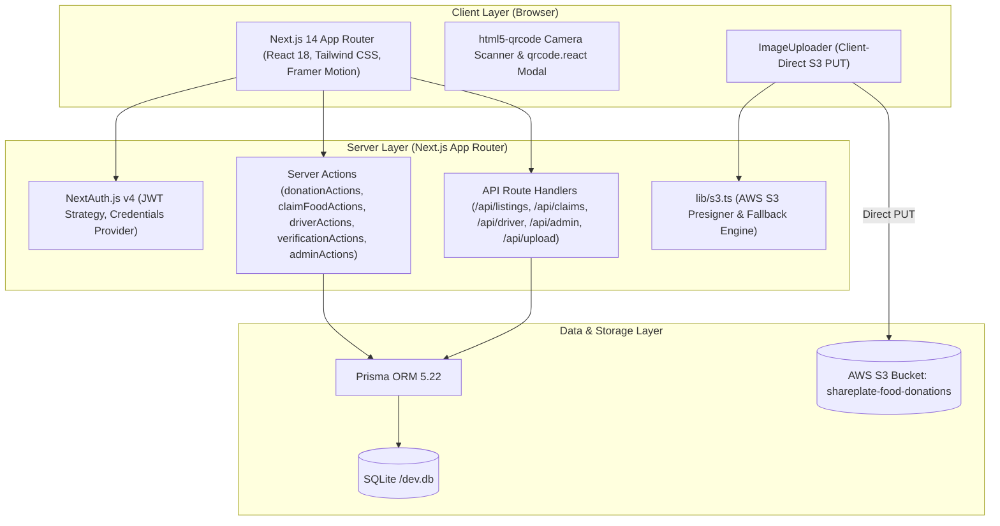
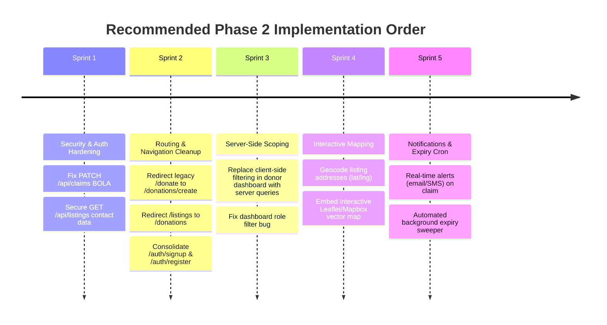

# Comprehensive Technical Audit: Food Donation & Rescue Platform

**Audit Date:** September 11, 2026 (Phase 1 Baseline Audit)  
**Project Name:** Food Donation / FoodRescue Full-Stack Platform (`food-donation-platform`)  
**Audit Scope:** Initial Codebase Inspection, Architectural Baseline, Security Assessment, and Phase 2 Roadmap.  
*(Note: As of Phase 2, the data tier has been upgraded from initial local SQLite prototyping to production Neon Serverless PostgreSQL with PgBouncer connection pooling. See [ARCHITECTURE.md](file:///c:/Users/Ayan%20Biswas/Desktop/Food%20Donation/docs/ARCHITECTURE.md) for the active production architecture).*

---

## Executive Summary

The project is an active, production-grade **Next.js 14 App Router** full-stack web application for surplus food rescue. It contains comprehensive role-based access control for four user archetypes (**Food Donors**, **NGO / Shelter Receivers**, **Volunteer Couriers**, and **Platform Admins**). Core production features—including **AWS S3 direct presigned image uploads**, **mandatory food safety checklists**, **cryptographic QR pickup verification**, **volunteer delivery coordination**, and an **image-first visual discovery feed**—are fully built and verified with zero build errors (`npm run build` exits code 0 across 24 routes).

This audit identified key strengths, architectural redundancies (legacy parallel routes and unlinked auxiliary microservices), authorization concerns, and clear optimization priorities for Phase 2.

---

## A. Current Architecture



### 1. Technology Stack & Versions
- **Core Framework:** Next.js `14.2.24` (App Router)
- **Frontend Core:** React `18.3.1`, React DOM `18.3.1`
- **Database & ORM:** Prisma ORM `5.22.0`, `@prisma/client 5.22.0`, SQLite (`dev.db`)
- **Authentication:** NextAuth.js `4.24.11`
- **Cloud Storage:** `@aws-sdk/client-s3 3.1130.0`, `@aws-sdk/s3-request-presigner 3.1130.0`
- **Animation & UI:** `framer-motion 13.2.0`, `lucide-react 0.475.0`, Tailwind CSS `3.4.17`
- **Hardware & QR:** `html5-qrcode 2.3.8`, `qrcode.react 4.2.0`
- **Cryptography:** `bcryptjs 2.4.3`
- **Runtime / Language:** Node.js, TypeScript `5.7.3`, `tsx 4.19.3`

### 2. Primary Workspace Structure
```
c:\Users\Ayan Biswas\Desktop\Food Donation\
├── app/                        # Next.js 14 App Router
│   ├── actions/                # Server Actions (Domain logic)
│   ├── admin/                  # Admin Moderation Dashboard
│   ├── api/                    # REST Endpoints (Auth, Upload, Claims, Driver, Admin)
│   ├── auth/                   # Sign In, Sign Up, Register
│   ├── dashboard/              # Role-based dashboards (donor, receiver, driver)
│   ├── donations/              # Discovery feed, Hero details, Create, QR Verify
│   ├── donate/                 # [Legacy] Prototype donation page
│   ├── listings/               # [Legacy] Prototype listings feed & detail
│   ├── layout.tsx              # Root Layout (Plus Jakarta Sans, Providers, Navbar, Footer)
│   └── page.tsx                # Public Landing Page (Hero, Stats, Testimonials)
├── components/                 # Shared UI Components (ImageUploader, Skeletons, Navbar, etc.)
├── lib/                        # Singletons (authOptions, prisma, s3)
├── prisma/                     # schema.prisma, seed.ts, dev.db
├── types/                      # TypeScript declarations (next-auth.d.ts)
├── backend/                    # [Auxiliary] Standalone Express + Mongoose + Socket.IO server
└── frontend/                   # [Auxiliary] Standalone Vite + React client
```

---

## B. Existing Features (Production-Ready)

| Feature | Primary Location | Status | Description |
| :--- | :--- | :--- | :--- |
| **Authentication & RBAC** | `lib/auth.ts`, `app/auth/signin` | **Production-Ready** | NextAuth JWT authentication with bcrypt hashing; 4 explicit roles (`DONOR`, `RECEIVER`, `VOLUNTEER`, `ADMIN`) with TypeScript module augmentation. |
| **Food Safety Compliance** | `app/donations/create/page.tsx`, `donationActions.ts` | **Production-Ready** | Mandatory 4-point safety checklist, temperature storage specification (`ROOM_TEMP`, `REFRIGERATED`, `FROZEN`), preparation timestamps, and future-timestamp blocking. |
| **AWS S3 Image Upload Engine** | `lib/s3.ts`, `ImageUploader.tsx`, `/api/upload/presigned-url` | **Production-Ready** | Direct client-to-bucket streaming via presigned PUT URLs, anti-collision key generator (`listings/{timestamp}-{hex}.ext`), and seamless offline dev fallback. |
| **Interactive Discovery Feed** | `app/donations/page.tsx` | **Production-Ready** | Framer Motion staggered entrance animations, full-bleed photography, real-time urgency countdowns (`⚡ Urgent <6h`), temperature pills, and keyword/location search filters. |
| **Hero Donation Details View** | `app/donations/[id]/page.tsx` | **Production-Ready** | Edge-to-edge high-res photo header, verified safety badge, interactive Google Maps directions card, and mobile sticky claim bar. |
| **QR Code Verification Engine** | `app/donations/verify/page.tsx`, `verificationActions.ts` | **Production-Ready** | Live camera scanner (`html5-qrcode`), manual fallback, scannable QR display modal (`qrcode.react`), atomic transaction state completion. |
| **Volunteer Courier Workspace** | `app/dashboard/driver/page.tsx`, `driverActions.ts` | **Production-Ready** | Real-time queue for unassigned pickups, task acceptance, in-transit transitions, donor/receiver phone links, and Google Maps navigation. |
| **Receiver Management Hub** | `app/dashboard/receiver/page.tsx` | **Production-Ready** | View claimed surplus batches, live QR token display modal with copy button, and direct link to donor pickup locations. |
| **Donor Management Hub** | `app/dashboard/donor/page.tsx` | **Production-Ready** | Track active listings, view real-time claim status, and quick-fill presets for new surplus posts. |
| **Admin Oversight Console** | `app/admin/page.tsx`, `adminActions.ts` | **Production-Ready** | Platform metrics, listing moderation (delete / status override), user role management, and admin self-deletion guard. |

---

## C. Incomplete Features & Unlinked Code

1. **Auxiliary Root Folders (`backend/` & `frontend/`):**
   - `backend/` contains an Express + Mongoose + Socket.IO server on port 5000 with socket handlers (`volunteer:update_location`).
   - `frontend/` contains a Vite + React application on port 5173.
   - **Finding:** Neither folder is linked or required by the primary Next.js App Router application. They represent an earlier decoupled prototype.
2. **Interactive Live Map SDK (Leaflet / Mapbox / Google Maps JS SDK):**
   - Currently, maps are implemented via deep-linking (`https://www.google.com/maps/search/?api=1&query=...`) and stylized CSS preview cards.
   - There is no interactive in-page map canvas with vector tiles, live courier pins, or geocoding coordinates (`latitude`/`longitude`).
3. **Automated Notification Engine:**
   - Client-side toasts (`Toast.tsx`) provide instant feedback, but there is no server-side notification pipeline (e.g. Email alerts via Resend/SendGrid, Webhooks, or SMS via Twilio when food is claimed or courier assigned).
4. **Automated Expiry Sweeper:**
   - Expired listings are checked upon render, but there is no background cron job or scheduled task to automatically transition listings to `EXPIRED` once `expiryTime < now()`.

---

## D. Bugs & Architectural Problems

### 1. Legacy Route Duplication & Broken Navigation Links
- **Landing Page (`app/page.tsx`):**
  - Line 88 links to `/donate` (legacy form without S3 upload and safety checklist) instead of `/donations/create`.
  - Line 96 links to `/listings` (legacy prototype feed) instead of `/donations`.
  - Line 253 uses `FoodCard`, which hardcodes links to `/listings/${id}` instead of `/donations/${id}` and fails to render `imageUrl`.
- **General Dashboard (`app/dashboard/page.tsx`):**
  - Lines 147, 201 link to `/donate`.
  - Lines 229, 242, 349 link to `/listings/${id}`.
- **Duplicate Registration Endpoints:**
  - `app/auth/register/page.tsx` and `app/auth/signup/page.tsx` duplicate identical registration forms.
  - `app/api/auth/register/route.ts` and `app/api/auth/signup/route.ts` execute duplicate logic.

### 2. Client-Side Data Leakage in Donor Dashboard
- In `app/dashboard/donor/page.tsx` line 40:
  ```ts
  const res = await fetch('/api/listings?status=ALL');
  // Filters client-side:
  const donorListings = session?.user?.id
    ? data.listings.filter((item: any) => item.donorId === session.user.id)
    : data.listings;
  ```
  If `session.user.id` is not immediately loaded, all listings in the system are rendered. Furthermore, the entire platform listing table (including phone numbers) is transmitted over the network to the browser.

### 3. General Dashboard Role Filtering Bug
- In `app/dashboard/page.tsx` line 113:
  ```ts
  const myListings = userRole === 'ADMIN'
    ? listings
    : listings.filter((l) => l.donorId === session?.user?.id || userRole === 'DONOR');
  ```
  The condition `|| userRole === 'DONOR'` causes any donor to see **all** listings rather than only their own!

---

## E. Security Issues

| Severity | Issue | File / Location | Description & Remediation |
| :--- | :--- | :--- | :--- |
| **HIGH** | **BOLA / IDOR on Claim Update** | `app/api/claims/route.ts` (`PATCH`) | Any authenticated user can modify any claim status (`PENDING`, `APPROVED`, `COMPLETED`) without checking if they are the donor, receiver, courier, or admin. Must enforce ownership verification before update. |
| **MEDIUM** | **Sensitive Data Overexposure** | `app/api/listings/route.ts` (`GET`) | An unauthenticated caller can request `/api/listings?status=ALL` and receive all claims, receiver details, and donor phone numbers. Non-public statuses (`CLAIMED`, `DELIVERED`) and contact details must require session authentication. |
| **MEDIUM** | **Hardcoded Secret Fallback** | `lib/auth.ts` line 70 | Defaults to `'food-donation-secret-key-super-safe-12345'` if `NEXTAUTH_SECRET` is missing. Must enforce strict environment variable existence in production. |
| **LOW** | **Missing Rate Limiting** | `/api/auth/signup`, `/donations/verify` | No rate limiting exists to prevent credential stuffing or brute-forcing 8-character QR secret tokens. |

---

## F. Performance Issues

1. **Unindexed Over-Fetching in Listings API:**
   - `prisma.foodListing.findMany` in `app/api/listings/route.ts` includes deep relations (`claims.receiver`, `donor`) for every item on every query. The public feed `/donations` only requires donor name and listing metadata.
2. **Lack of Database Pagination:**
   - Both `/donations` and `/api/listings` fetch all matching rows with no `limit` or `cursor/offset` pagination. As listings scale into thousands, this will degrade memory and bandwidth.
3. **Over-Aggressive Revalidation:**
   - Server Actions invoke 6+ `revalidatePath` calls simultaneously (e.g. `revalidatePath('/donations')`, `revalidatePath('/listings')`, `revalidatePath('/')`, `revalidatePath('/dashboard')`, etc.), causing unnecessary cache busts across the entire application.

---

## G. Recommended Implementation Order for Phase 2



### Phase 2 Execution Breakdown:
1. **Sprint 1: Security & Authorization Hardening**
   - Add ownership validation to `PATCH /api/claims` (verify user is claim receiver, donor, or admin).
   - Redact donor phone numbers and claim objects from unauthenticated `GET /api/listings`.
2. **Sprint 2: Routing & UI Consolidation**
   - Update `app/page.tsx` and `app/dashboard/page.tsx` CTA links to point directly to `/donations/create` and `/donations`.
   - Update `FoodCard.tsx` to link to `/donations/${id}` and render `imageUrl`.
   - Add permanent redirects from `/donate` -> `/donations/create` and `/listings` -> `/donations`.
   - Consolidate `/auth/register` to redirect to `/auth/signup`.
3. **Sprint 3: Performance & Query Scoping**
   - Add `donorId` query parameter to `/api/listings` so donor dashboard only retrieves user-owned records.
   - Implement pagination (`take: 12`, `skip: N`) on `/donations`.
4. **Sprint 4: Interactive Live Mapping**
   - Add `latitude` and `longitude` fields to `FoodListing` and `User`.
   - Embed interactive Leaflet or Mapbox map on `/donations` and `/dashboard/driver`.
5. **Sprint 5: Background Jobs & Notifications**
   - Implement email/SMS notifications for urgent pickups.
   - Add automated cron task to mark past-expiry listings as `EXPIRED`.
